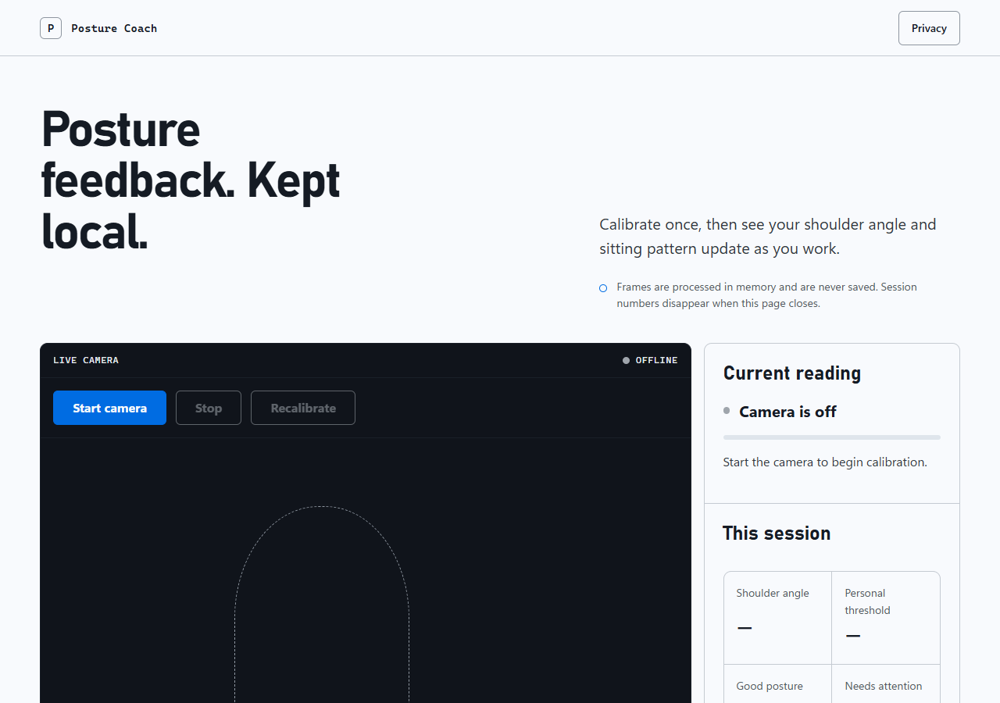

# Posture Coach

[](https://github.com/alirezarashidipp/hunchback-detection/actions/workflows/ci.yml)
[](https://www.python.org/)
[](LICENSE)

Private, local-first posture feedback from a live browser camera. Posture Coach
uses MediaPipe and FastAPI to estimate an ear–shoulder–hip angle, personalize a
baseline, and show bad-posture duration and session statistics without saving
images.



## Why this project

- **Live browser experience:** camera preview, pose overlay, current angle, and
  immediate posture state.
- **Personal calibration:** a short baseline adapts feedback to the person and
  camera placement.
- **Session awareness:** tracks poor-posture time and upright percentage for the
  current tab.
- **Local-first privacy:** frames travel only between the browser and the local
  FastAPI process, are analyzed in memory, and are never written to disk.
- **Two interfaces:** a polished web app plus webcam and video-file CLI tools.
- **Production-minded foundation:** typed modules, automated tests, CI, a
  non-root read-only container, health checks, and contributor documentation.

> Posture Coach is an educational wellness tool, not a medical device. It does
> not diagnose, treat, or prevent any condition.

## Quick start with Docker

Docker Desktop is the only prerequisite.

```bash
docker compose up --build
```

Open [http://localhost:8000](http://localhost:8000), select **Start camera**, and
allow camera access. Stop the app with:

```bash
docker compose down
```

The service binds to `127.0.0.1` only. The container runs as an unprivileged
user with a read-only filesystem.

## Native development

MediaPipe supports Python 3.11 and 3.12 for this project.

```bash
python -m venv .venv
# Windows: .venv\Scripts\activate
# macOS/Linux: source .venv/bin/activate
python -m pip install --upgrade pip
python -m pip install -e ".[dev]"
hunchback-web
```

Then open [http://localhost:8000](http://localhost:8000). Browser camera access
works on localhost or a secure HTTPS origin.

## CLI

Use a directly connected webcam:

```bash
hunchback-live --threshold 160
```

Analyze a local video and optionally write an annotated copy:

```bash
hunchback-video --input-path input.mp4 --output-path annotated.mp4 --threshold 160
```

Press `q` to close an OpenCV preview window. Run either command with `--help`
for all options.

## How it works

```text
Browser camera -> compressed JPEG frame -> local WebSocket -> MediaPipe pose
              <- angle, landmarks, status <- in-memory analysis <-
```

The detector measures the angle formed by the left ear, shoulder, and hip. The
browser collects a short set of valid
readings, derives a personal threshold from their median, and keeps all timing
and summary data in memory for the current page session.

See [Architecture](docs/architecture.md), [Calibration](docs/calibration.md),
and [Privacy](docs/privacy.md) for the detailed contracts.

## Quality checks

```bash
python -m ruff format --check .
python -m ruff check .
python -m mypy
python -m pytest --cov=hunchback_detection --cov-report=term-missing
node --test tests/js/*.test.mjs
python -m build
docker compose build
```

## Project map

```text
src/hunchback_detection/
├── posture.py       # geometry and classification
├── vision.py        # MediaPipe frame analysis
├── video_stream.py  # webcam and video CLI
├── web.py           # FastAPI HTTP and WebSocket app
├── static/          # modular CSS and JavaScript
└── templates/       # accessible web shell
tests/               # Python and browser-logic tests
docs/                # architecture, privacy, calibration, and operations
```

## Documentation

- [Architecture](docs/architecture.md)
- [Privacy model](docs/privacy.md)
- [Calibration guide](docs/calibration.md)
- [Development guide](docs/development.md)
- [Troubleshooting](docs/troubleshooting.md)
- [Security policy](SECURITY.md)
- [Contributing](CONTRIBUTING.md)
- [Changelog](CHANGELOG.md)

## Limitations

- Side-on framing with the ear, shoulder, and hip visible produces the most
  useful signal.
- Loose clothing, occlusion, low light, and camera perspective can reduce pose
  quality.
- A single geometric threshold is an ergonomic prompt, not clinical evidence.
- Session statistics reset when the page is refreshed or closed.

## License

Released under the [MIT License](LICENSE).
